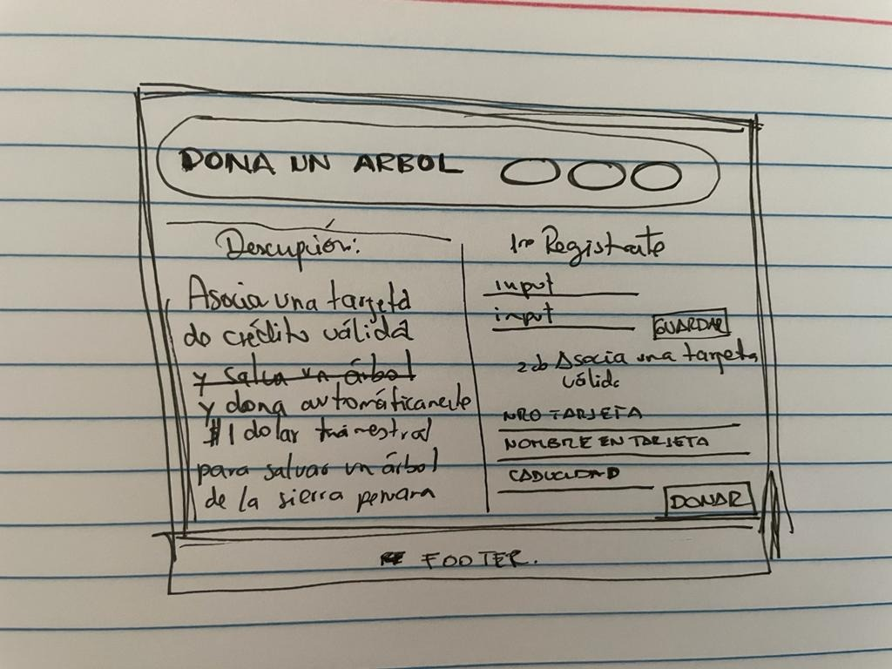
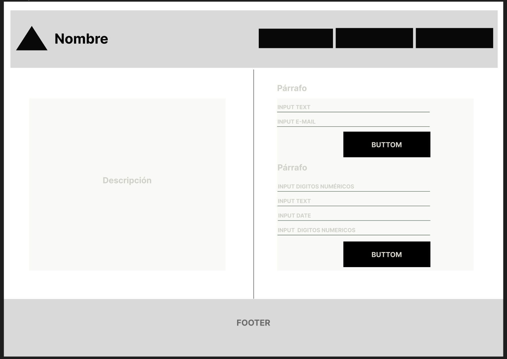
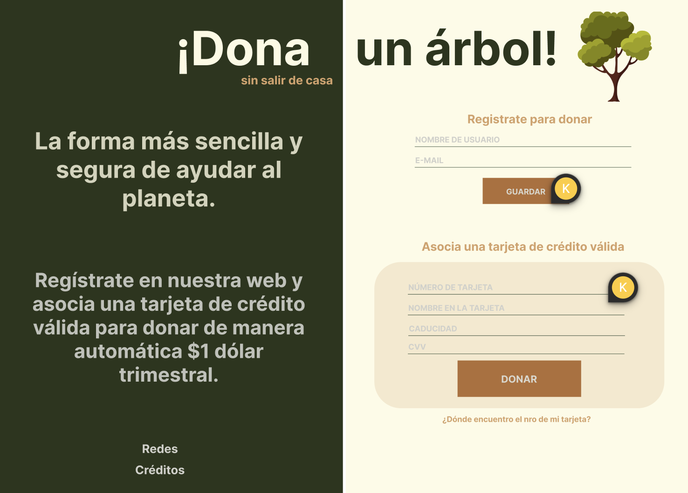
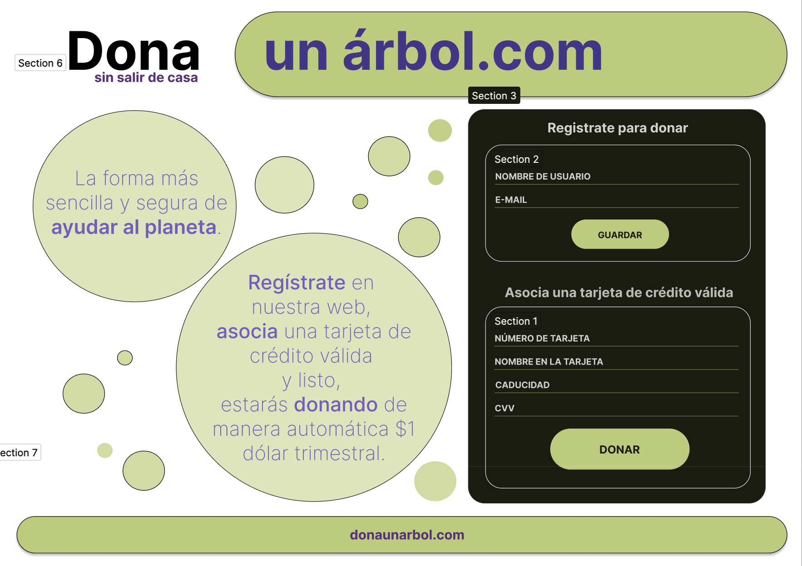
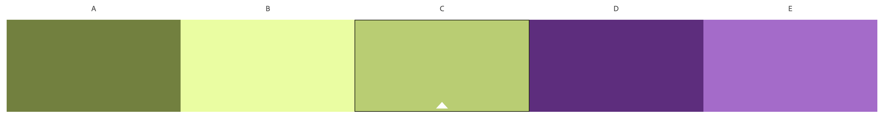
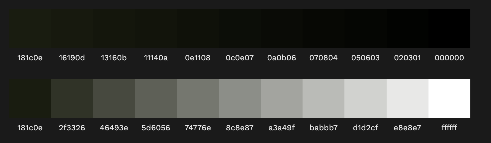
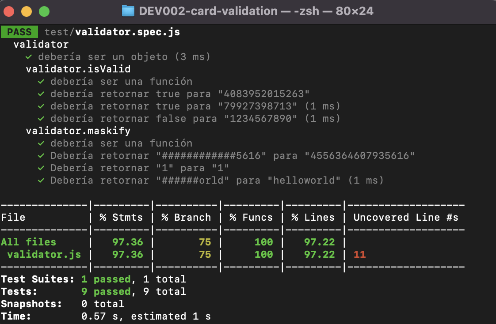

# Validar tarjeta de crédito

## Definición del producto

Pensé en una página que acepte donaciones para plantar árboles, esto se hace mediante la asociación de una tarjeta de crédito que sea válida, la validación se hace mediante el algoritmo de Luhm.  
La página se llama **Dona un árbol. com**, y ayuda a crear un fondo colectivo para ser utilizado en la plantación de distintas especies de árboles en los espacios que más requieran.

### Quiénes son los principales usuarios de producto.
Personas interesadas en contribuir a la disminución del impacto ambiental,
que a su vez cuenten con una tarjeta de crédito válida y estén dispuestos a hacer una 
donación trimestral de 1$.

### Cuáles son los objetivos de estos usuarios en relación con tu producto.
* Interactuar con una página web atractiva e intuitiva.
* Registrar datos principales para ser parte de una comunidad, mediante la creación de un usuario y correo electrónico.
* Asociar una tarjeta de crédito válida de manera segura.

### Cómo crees que el producto que estás creando está resolviendo sus problemas.

En **Donaunárbol. com**, el usuario puede:
* Ubicarse gentil e intuitivamente en los elementos que contiene.
* Registrar su nombre y correo electrónico.
* Validar los datos de una tarjeta de crédito SI y SOLO SI los datos solicitados están completos.
* Saber si su donación a sido recibida o no, esto se da SI Y SOLO SI el número de tarjeta ingresado es válida, esta validación se realiza mediante el algoritmo de Luhn.

## Interfaz de usuario (UI)

La interfaz permite al usuario:

* Ubicarse gentil e intuitivamente en el entorno de la página.
* Registrar sus datos ingresando un nombre de usuario y un email, permite guardarlos SI Y SOLO SI los datos solicitados no están vacíos. Luego muestra una alerta para permitir al usuario continuar con la asociación de la tarjeta.
* Asociar una tarjeta de crédito ingresando un número de tarjeta, el nombre en la tarjeta, la fecha de expiración y el CVV, permite validar los datos ingresados SI y SOLO SI todos los datos solicitados no están vacíos.
* Si el número de tarjeta ingresado es válida (mediante el algoritmo de Luhn), muestra una alerta de Bienvenida, caso contrario alerta al usuario que el nro de tarjeta no es válida y pide ingresar datos correctos.
* En caso de que el nro de tarjeta sea válida, esta se enmascara dejando visible solo los últimos 4 dígitos.

## UX (Diseño de experiencia de usuario)

Antes de iniciar a codear, debes entender el problema que quieres solucionar y
cómo tu aplicación lo soluciona.

* Primer prototipo con papel y lápiz (blanco y negro).

* Feedback:
    1. No se entiende donde ponen el número de la tarjeta, confunden los inputs, pero quizá con el prototipo de alta fidelidad se entienda mejor. 
    2. Para aportar creo que quizá podría faltar una casilla para ingresar el código de seguridad para hacer la transacción de pago (cómo en webpay).
    3. Es una idea muy noble.

* Segundo prototipo de baja fidelidad usando [Figma](https://www.figma.com/).


* Primer prototipo alta fidelidad usando [Figma](https://www.figma.com/).
.

1. Se entiende el propósito de la página.
2. Los colores podrían mejorar.
3. Se asemeja a un documento imprimible.
* Prototipo final alta fidelidad usando [Figma](https://www.figma.com/)

1. Mejoré la legibilidad de las secciones, los inputs y botones.
2. Apliqué la teoría del color, eligiendo una paleta de colores acorde al objetivo de la página y definiendo colores principales, secundarios y neutros.
3. Le di más dinamismo con figuras y contraste de colores.

## Visualmente (HTML y CSS)

Para este momento tuve que revisar nuevamente todas las posibilidades que da el CSS y descubrí que había algunas cosas que podía mejorar en el prototipo de alta fidelidad que realicé para que el apartado de **Asociar tarjeta de crédito válida** quede más legible y atractivo para el usuario.

##### `src/index.html`

En este archivo va el contenido que se mostrará al usuario (esqueleto HTML).
* Dentro de la etiqueta `<body>` están 2 etiquetas principales
    - `<main>`: contenido principal del proyecto.
    - `<footer>`: pie de página del proyecto.
* Dentro de la etiqueta `<main>` están 4 etiquetas que permiten estructurar la página.
    - `<header>`: encabezado de página del proyecto.
    - `<div>`: es parte del encabezado, pero tiene una división y estilo distinto al header.
    - `<article>`: sección izquierda del proyecto, contiene 6 etiquetas donde se explica la página web y donde se ubican figuras de fondo. Se les otorgó la clase `lado izquierdo` que nos permitirá trabajar los estilos posteriormente.
    - `<section>`: sección derecha del proyecto, contiene 2 etiquetas que son formularios de registro, se le otorgó la clase `lado derecho` que nos permitirá trabajar los estilos posteriormente.
* Dentro de la etiqueta `<section>`.
    - `<form class="box-registrarse">`: contiene un formulario para registrar datos de usuario.
    - `<form class="box-datos-tarjeta">`: Contiene un formulario para validar tarjeta de crédito.

##### `src/style.css`

Este archivo debe contener las reglas de estilo. Queremos que escribas tus
propias reglas, por eso NO está permitido el uso de frameworks de CSS
(Bootstrap, materialize, etc).





## Funcionalmente (JavaScript - pruebas unitarias)

Vas a tener 2 archivos JavaScript separando responsabilidades, a continuación
indicamos qué harás en cada archivo:

##### `src/validator.js`

Acá encontrarás las funciones necesarias para que el usuario pueda verificar la
tarjeta de crédito y ocultar los dígitos de su número de tarjeta.
Esta función debe ser pura e independiente del DOM.

Para esto se implementó el **objeto `validator`**, el cual ya se encuentra
_exportado_ en el _boilerplate_. Este objeto (`validator`) contiene
dos métodos (`isValid` y `maskify`):

* **`validator.isValid(creditCardNumber)`**: `creditCardNumber` es un `string`
con el número de tarjeta que se va a verificar. Esta función retorna un
`boolean` dependiendo si es válida de acuerdo al [algoritmo de Luhn](https://es.wikipedia.org/wiki/Algoritmo_de_Luhn).

* **`validator.maskify(creditCardNumber)`**: `creditCardNumber` es un `string` con
el número de tarjeta y esta función retorna un `string` donde todos menos
los últimos cuatro caracteres sean reemplazados por un numeral (`#`).
Esta función siempre mantiene los últimos cuatro caracteres intactos, aún
cuando el `string` sea de menor longitud.

    Ejemplo de uso

    ```js
    maskify('4556364607935616') === '############5616'
    maskify(     '64607935616') ===      '#######5616'
    maskify(               '1') ===                '1'
    maskify(               '')  ===                ''
    ```

##### `src/index.js`

Acá está todo el código que tenga que ver con la interacción del DOM
(seleccionar, actualizar y manipular elementos del DOM y eventos).
Es decir, en este archivo se invocan las funciones `isValid` y `maskify`
según sea necesario para actualizar el resultado en la pantalla (UI).

##### `test/validator.spec.js`

En este archivo se completaron las pruebas unitarias de las funciones
`validator.isValid(creditCardNumber)` y `validator.maskify(creditCardNumber)`
implementadas en `validator.js` utilizando [Jest](https://jestjs.io/es-ES/).
Tus pruebas unitarias dan:



***